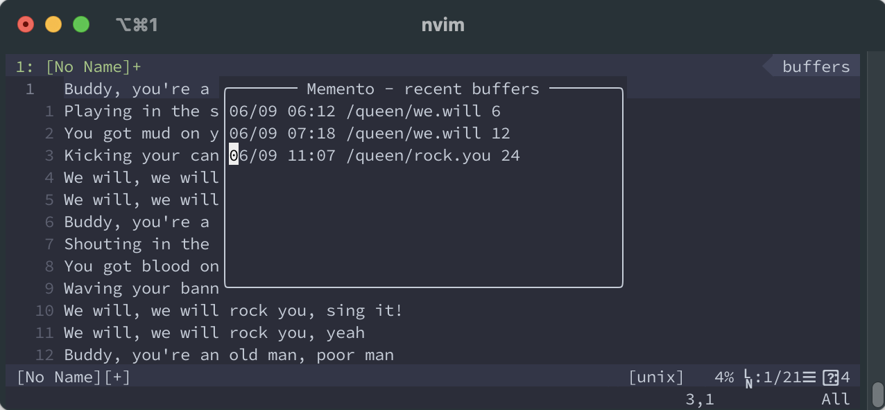

# Recall.nvim

A NeoVim plugin which remembers where you've been



When a buffer is deleted (e.g.: `:q`, `:bd`) `recall.nvim` stores the filepath, and current line number so
you can check your history and easily go back to a file. The history is persistent across sessions.

> Imagine, you are editing 3 files and in the heat of development you close `nvim` to open it up
> in another directory (happened with me to many times).
> Still, you'd like to use those files, so you'd need to open them up one-by-one knowing the path of the file.
> With this plugin you just hit the right keys (or call `:lua require("recall").toggle()`)
> and you can check your history and open them up again easily from a popup menu.

*(The plugin is mostly for my personal use, but PRs are welcome)*

# Install

```lua
Plug 'nvim-lua/plenary.nvim' -- if you already have this you don't need to include it again
Plug 'gaborvecsei/recall.nvim'
```

# Usage

```lua
-- Open up history popup menu
:lua require("recall").toggle()

-- Clear history
:lua require("recall").clear_history()
```

When the popup is visible, you can **close it with `q`** and **open up any file at any line by hitting `<CR>`**

## Keybinding

```lua
nnoremap <leader>mh <cmd>lua require('recall').toggle()<CR>
```

# Configuration

| Variable                | Description                                                                                                | Type   | Default |
|-------------------------|------------------------------------------------------------------------------------------------------------|--------|---------|
| `recall_history`       | Length of the history                                                                                      | `int`  | `20`    |
| `recall_shorten_path`  | Compact representation of the filepath. (e.g.: `/t/i/a/t/script.py` instead of `/this/is/a/test/script.py` | `bool` | `true`  |
| `recall_window_width`  | Popup window's width                                                                                       | `int`  | `80`    |
| `recall_window_height` | Popup window's height                                                                                      | `int`  | `14`    |

```lua
vim.g.recall_history = 20
vim.g.recall_shorten_path = true
vim.g.recall_window_width = 80
vim.g.recall_window_height = 14
```

